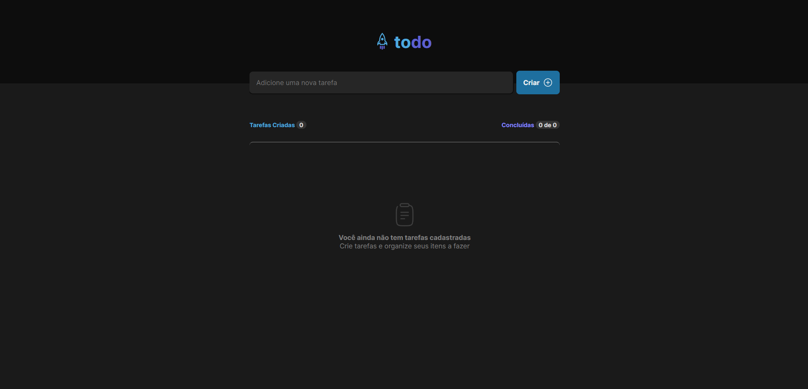

# React Todo App



## 💻 Pré-requisitos

Antes de começar, verifique se você atendeu aos seguintes requisitos:

* Você tem uma máquina `<Windows / Linux / Mac>`.

## 🚀 Instalando React Todo App

Para instalar siga estas etapas:

> Clone o repo

```zsh
git clone git@github.com:deverebor/react-todo-app.git
```

> Entre no diretório do repo

```zsh
cd react-todo-app
```

> Instale as dependências

```zsh
yarn install
```

## ☕ Usando o projeto

Siga estas etapas:

> Inicialize o projeto

```zsh
yarn dev
```

---

<p align='center'>
  Developer with ❤️‍🔥 by Lucas Souza (@deverebor)
</p>
